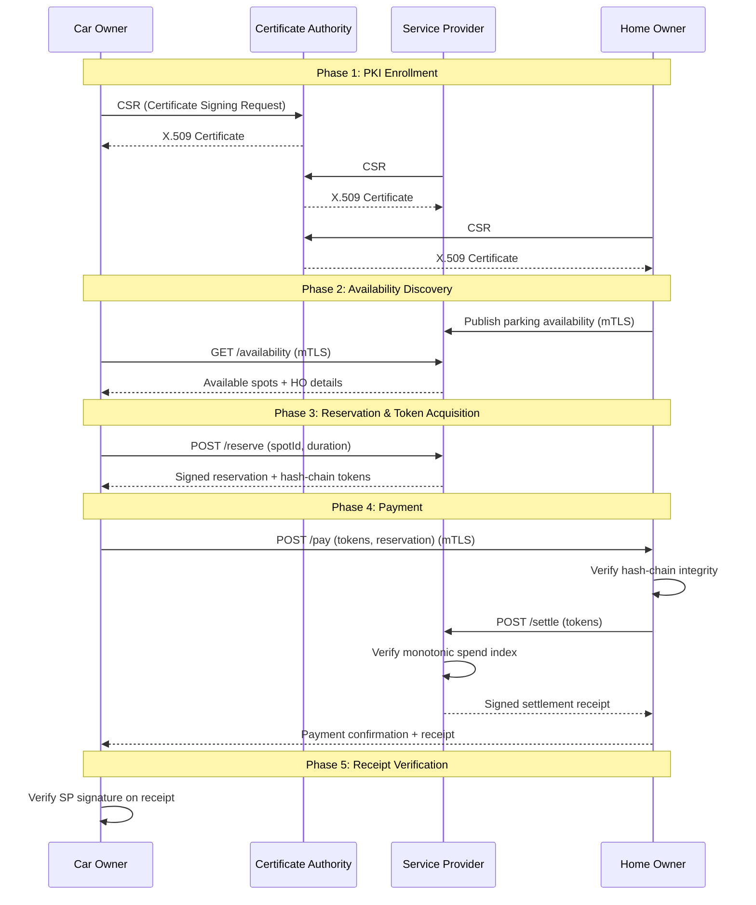

# Secure Private Parking Payment System

A distributed parking payment system implementing mutual TLS (mTLS) authentication, hash-chain based micropayments, and comprehensive security controls. Built as a security-focused demonstration of cryptographic protocols for IoT/embedded payment scenarios.

## Architecture Overview

The system consists of four main components communicating over mTLS:

| Component | Role | Port |
|-----------|------|------|
| **CAuth** | Certificate Authority - issues X.509 certificates to all parties | 8443 |
| **SP** | Service Provider - manages parking spots, issues payment tokens, settles transactions | 8444 |
| **HO** | Home Owner - owns parking spots, accepts payments, verifies tokens | 8445 |
| **CO** | Car Owner - discovers parking, acquires tokens, makes payments | Client |



## Quick Start

### Prerequisites

- Docker & Docker Compose
- tmux (for interactive dashboard)
- bash

### Setup PKI Infrastructure

```bash
cd crypto_do_once
./setup_trust.sh
cd ..
```

This generates all keystores, truststores, and the Root CA certificate.

### Run Interactive Dashboard

```bash
./start.sh
```

This opens a 6-pane tmux dashboard showing real-time logs from all services and runs all security test scenarios automatically.

### Run Tests Manually

```bash
# Start core services
sudo docker compose up -d cauth sp ho

# Run happy path
sudo docker compose run --rm co

# Run specific security scenario
sudo docker compose run --rm -e NEG_TEST_MODE=TAMPER co
```

### Clean Up

```bash
sudo docker compose down -v
```

## Security Test Scenarios

The system includes automated tests for 6 security scenario categories:

| # | Scenario | Description | Expected Result |
|---|----------|-------------|-----------------|
| 1 | **P1_HONEST** | Normal payment flow (baseline) | ✓ Payment succeeds |
| 2 | **M4.1_TOKEN_TAMPER** | Flip byte in payment token | ✗ HO rejects (hash chain fails) |
| 3 | **M4.2_REPLAY** | Replay same payment twice (HO-level and SP-level detection) | ✗ Rejected as duplicate/double-spend |
| 4 | **FAKE_CAUTH** | Enroll with rogue CA, connect to SP | ✗ SP rejects (PKIX validation fails) |
| 5 | **ROGUE_CO** | Connect without cert (MISSING) or with self-signed cert (SELF_SIGNED) | ✗ TLS handshake fails |
| 6 | **RESV_TAMPER** | Tamper reservation: modify price, reorder fields, corrupt signature, or drop fields | ✗ Signature/schema validation fails |

Run all scenarios:

```bash
./run_all_scenarios.sh
```

## Environment Variables

### CO (Car Owner)

| Variable | Values | Description |
|----------|--------|-------------|
| `NEG_TEST_MODE` | `NONE`, `TAMPER`, `REPLAY`, `RESV_TAMPER`, `BAD_CERT`, `FAKE_CAUTH` | Security scenario to execute |
| `TAMPER_TOKEN_INDEX` | `0-n` | Which token to tamper (M4.1) |
| `RESV_TAMPER_MODE` | `FIELD_EDIT`, `REORDER`, `SIG_FLIP`, `DROP_FIELD` | Reservation tampering variant |
| `BAD_CERT_MODE` | `MISSING`, `SELF_SIGNED` | Client auth failure variant |

### HO (Home Owner)

| Variable | Values | Description |
|----------|--------|-------------|
| `REPLAY_TEST_MODE` | `true`, `false` | Allow duplicate payments (testing only) |

## Security Properties

- **TLS 1.3/1.2 enforced** - Older versions disabled (BEAST, POODLE, CRIME mitigation)
- **Mutual TLS (mTLS)** - All parties authenticate via X.509 certificates
- **Hash-chain tokens** - Tamper-evident payment instruments with cryptographic binding
- **Monotonic spend tracking** - Double-spend protection via atomic index updates
- **Canonical signatures** - Deterministic JSON serialization prevents reordering attacks
- **Non-repudiation** - SP-signed receipts provide cryptographic proof of settlement

## Project Structure

```
├── cauth/              # Certificate Authority service
├── sp/                 # Service Provider service
├── ho/                 # Home Owner service
├── co/                 # Car Owner client
├── fake-cauth/         # Rogue CA for testing
├── crypto_do_once/     # PKI setup scripts
├── figures/            # Security evaluation diagrams
├── logs/               # Test run outputs
├── start.sh            # Interactive dashboard launcher
├── run_all_scenarios.sh # Automated test runner
└── SECURITY_EVALUATION.md # Detailed security analysis
```
